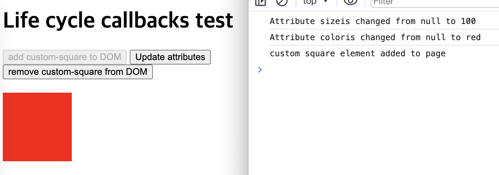
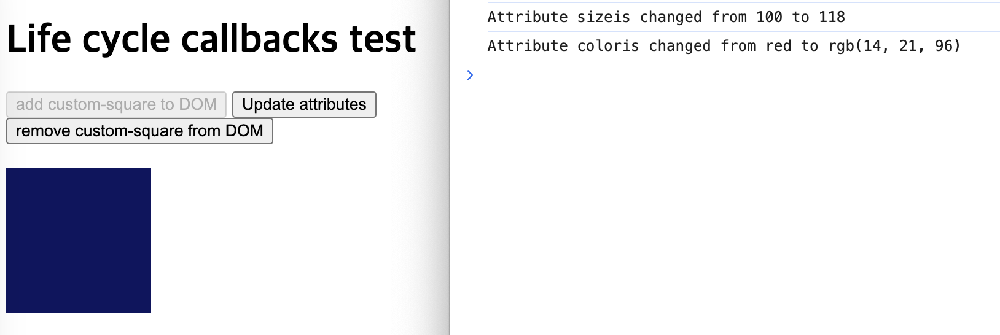
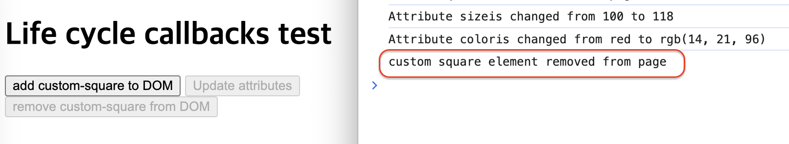

## Custom Elements

### `attributeChangedCallback`

- 사용자 정의 요소의 특성 중 하나가 추가되거나, 제거되거나, 변경될 때 호출
- 어떤 특성의 변경에 대해 알릴지는 static get `observedAttributes` 메서드에서 명시 됨
- 3가지 매개변수를 입력 받는다. (name, oldValue, newValue)
- 특성의 이름, 이전 값, 새로운 값을 특성의 변경 사항에 개별적으로 대응 가능

 

참고

> [MDN](https://developer.mozilla.org/ko/docs/Web/API/Web_components/Using_custom_elements#%EC%83%9D%EB%AA%85_%EC%A3%BC%EA%B8%B0_%EC%BD%9C%EB%B0%B1_%EC%82%AC%EC%9A%A9%ED%95%98%EA%B8%B0) & [MDN github](https://github.com/mdn/web-components-examples/blob/main/life-cycle-callbacks/main.js)
>
> https://velog.io/@rageboom/Custom-Elements
>
> https://leirbag.tistory.com/132
