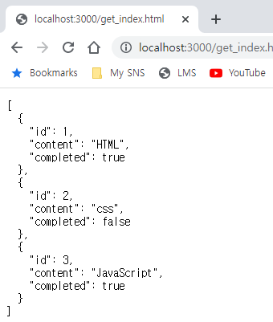
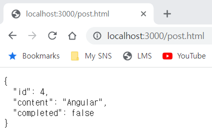
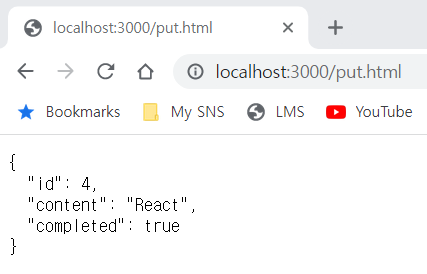
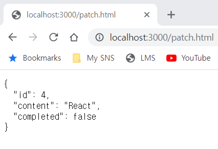
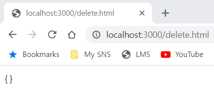

# REST API

JSON sever가 데이터베이스 역할을 하는 db.json 파일의 변경을 감지하게 하려면 watch 옵션 추가

```jsx
## 기본 포트(3000) 사용 / watch 옵션 적용
$ json-server --watch db.json
```
`json-server` 오류 발생시 -> <a href="https://velog.io/@su_jin1127/json-server%EC%9D%80%EB%8A%94-%EB%82%B4%EB%B6%80-%EB%98%90%EB%8A%94-%EC%99%B8%EB%B6%80-%EB%AA%85%EB%A0%B9-%EC%8B%A4%ED%96%89%ED%95%A0-%EC%88%98-%EC%9E%88%EB%8A%94-%ED%94%84%EB%A1%9C%EA%B7%B8%EB%9E%A8-%EB%98%90%EB%8A%94%EB%B0%B0%EC%B9%98-%ED%8C%8C%EC%9D%BC%EC%9D%B4-%EC%95%84%EB%8B%99%EB%8B%88%EB%8B%A4" target="_blank"></a>

## GET 요청

todos 리소스에서 모든 todo를 **취득(index)** 한다

```jsx
    <script>
        // XMLHttpRequest 객체 생성
        const xhr = new XMLHttpRequest();

        // HTTP 요청 초기화
        // todos 리소스에서 모든 todo를 취득(index)
        xhr.open('GET', '/todos');

        // HTTP 요청 전송
        xhr.send();

        // load 이벤트는 요청이 성공적으로 완료된 경우 발생
        xhr.onload = () => {
            // status 프로퍼티 값이 200이면 정상적으로 응답된 상태
            if (xhr.status === 200){
                document.querySelector('pre').textContent = xhr.response;
            }
            else {
                console.error('Error', xhr.status, xhr.statusText);
            }
        };
    </script>
```



todos 리소스에서 id를 사용하여 특정 todo를 **취득(retrieve)** 하기

```jsx
    <script>
        // XMLHttpRequest 객체 생성
        const xhr = new XMLHttpRequest();

        // HTTP 요청 초기화
        // todos 리소스에서 모든 todo를 취득(index)
        xhr.open('GET', '/todos/1');

        // HTTP 요청 전송
        xhr.send();

        // load 이벤트는 요청이 성공적으로 완료된 경우 발생
        xhr.onload = () => {
            // status 프로퍼티 값이 200이면 정상적으로 응답된 상태
            if (xhr.status === 200){
                document.querySelector('pre').textContent = xhr.response;
            }
            else {
                console.error('Error', xhr.status, xhr.statusText);
            }
        };
    </script>
```


## POST 요청

POST 요청 시에는 `setRequestHeader` 메서드를 사용하여 요청 몸체에 담아 서버로 전송할 페이로드의 MIME 타입을 지정해야 함

```jsx
    <script>
        // XMLHttpRequest 객체 생성
        const xhr = new XMLHttpRequest();

        // HTTP 요청 초기화
        // todos 리소스에서 새로운 todo를 생성
        xhr.open('POST', '/todos');

        // 요청 몸체에 담아 서버로 전송할 페이로드의 MIME 타입을 지정
        xhr.setRequestHeader('content-type', 'application/json');

        // HTTP 요청 전송
        xhr.send(JSON.stringify({ id: 4, content: 'Angular', completed: false }));

        // load 이벤트는 요청이 성공적으로 완료된 경우 발생
        xhr.onload = () => {
            // status 프로퍼티 값이 200(OK) 또는 201(Created)이면 정상적으로 응답된 상태
            if (xhr.status === 200 || xhr.status === 201) {
                document.querySelector('pre').textContent = xhr.response;
            }
            else {
                console.error('Error', xhr.status, xhr.statusText);
            }
        };
    </script>
```



## PUT 요청

PUT은 특정 리소스 전체를 교체할 때 사용

todos 리소스에서 id로 todo를 특정하여 id를 제외한 리소스 전체를 교체

PUT 요청 시에는 `setRequestHeader` 메서드를 사용하여 요청 몸체에 담아 서버로 전송할 페이로드의 MIME 타입 지정

```jsx
<script>
        // XMLHttpRequest 객체 생성
        const xhr = new XMLHttpRequest();

        // HTTP 요청 초기화
        // todos 리소스에서 id로 todo를 특정하여 id를 제외한 리소스 전체를 교체
        xhr.open('PUT', '/todos/4');

        // 요청 몸체에 담아 서버로 전송할 페이로드의 MIME 타입을 지정
        xhr.setRequestHeader('content-type', 'application/json');

        // HTTP 요청 전송
        // 리소스 전체를 교체하기 위해 페이로드를 서버에 전송해야 한다.
        xhr.send(JSON.stringify({ id: 4, content: 'React', completed: true }));

        // load 이벤트는 요청이 성공적으로 완료된 경우 발생
        xhr.onload = () => {
            // status 프로퍼티 값이 200이면 정상적으로 응답된 상태
            if (xhr.status === 200){
                document.querySelector('pre').textContent = xhr.response;
            }
            else {
                console.error('Error', xhr.status, xhr.statusText);
            }
        };
    </script>
```



## PATCH 요청

특정 리소스의 일부를 수정할 때 사용

다음 코드는 todos 리소스의 id로 todo를 특정하여 completed만 수정

PATCH 요청 시에는 `setRequsetHeader` 메서드를 사용하여 요청 몸체에 담아 서버로 전송할 페이로드의 MIME 타입을 지정해야함

```jsx
<script>
        // XMLHttpRequest 객체 생성
        const xhr = new XMLHttpRequest();

        // HTTP 요청 초기화
        // todos 리소스에서 id로 todo를 특정하여 completed만 수정
        xhr.open('PATCH', '/todos/4');

        // 요청 몸체에 담아 서버로 전송할 페이로드의 MIME 타입을 지정
        xhr.setRequestHeader('content-type', 'application/json');

        // HTTP 요청 전송
        // 리소스를 수정하기 위해 페이로드를 서버에 전송
        xhr.send(JSON.stringify({ completed: false }));

        // load 이벤트는 요청이 성공적으로 완료된 경우 발생
        xhr.onload = () => {
            // status 프로퍼티 값이 200이면 정상적으로 응답된 상태
            if (xhr.status === 200){
                document.querySelector('pre').textContent = xhr.response;
            }
            else {
                console.error('Error', xhr.status, xhr.statusText);
            }
        };
    </script>
```



## DELETE 요청

todos 리소스에서 id를 사용하여 todo를 삭제

```jsx
<script>
        // XMLHttpRequest 객체 생성
        const xhr = new XMLHttpRequest();

        // HTTP 요청 초기화
        // todos 리소스에서 id를 사용하여 todo를 삭제
        xhr.open('DELETE', '/todos/4');

        // HTTP 요청 전송
        xhr.send();

        // load 이벤트는 요청이 성공적으로 완료된 경우 발생
        xhr.onload = () => {
            // status 프로퍼티 값이 200이면 정상적으로 응답된 상태
            if (xhr.status === 200){
                document.querySelector('pre').textContent = xhr.response;
            }
            else {
                console.error('Error', xhr.status, xhr.statusText);
            }
        };
    </script>
```

