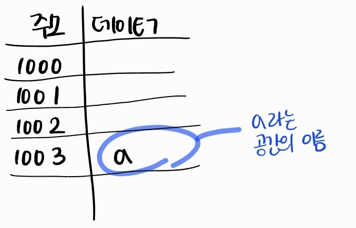
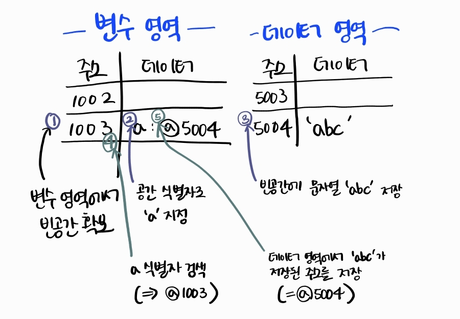
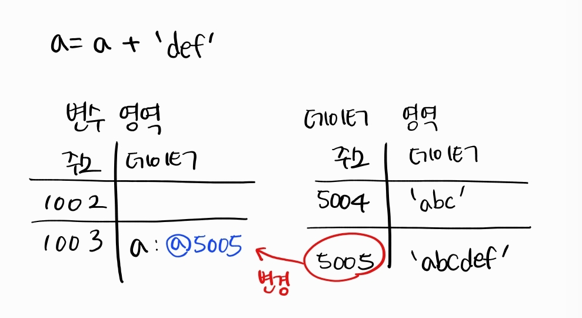
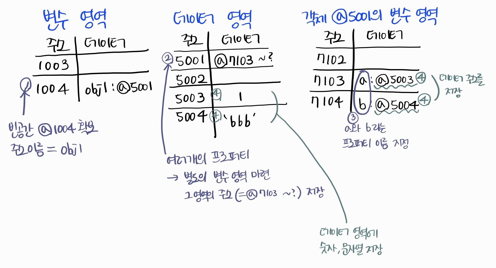
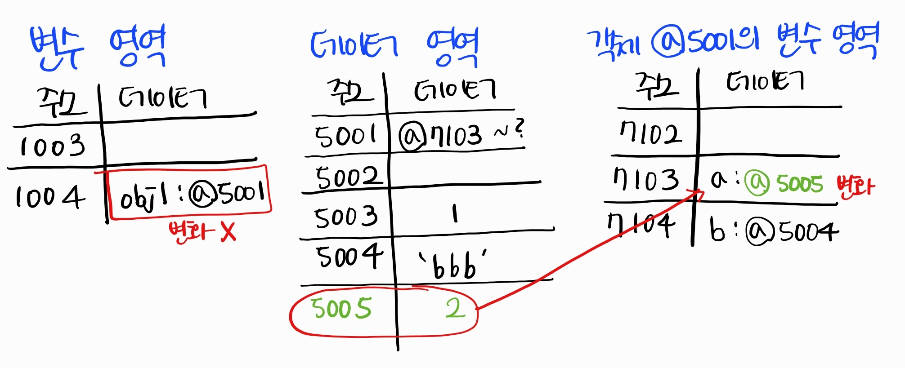
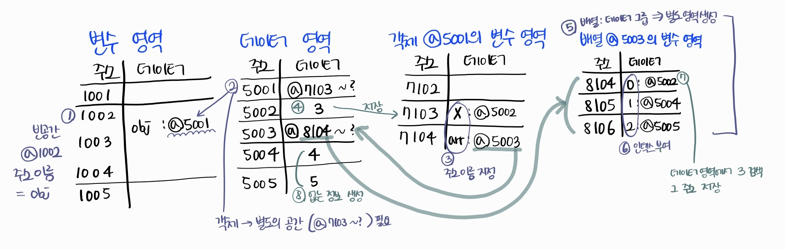
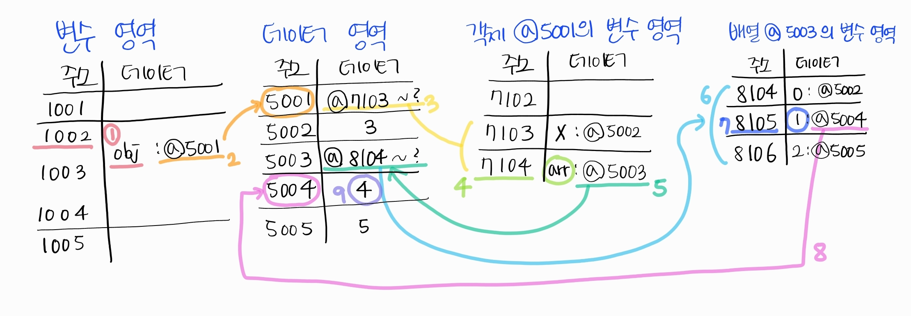
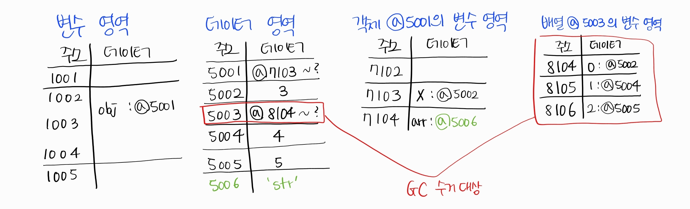
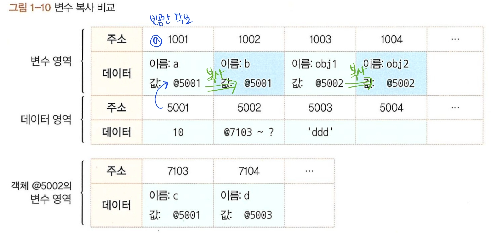

# 데이터 타입

<aside>
💡 자바스크립트가 데이터를 처리하는 과정
→ 기본형 타입과 참조형 타입이 서로 다르게 동작하는 이유

</aside>

## 01 데이터 타입의 종류

### 1️⃣ 기본형 primitive type

숫자, 문자열, 불리언, null, undefined, 심볼

### 2️⃣ 참조형 reference type

객체, 배열, 함수, 날짜, 정규표현식, Map, WeakMap, Set, WeakSet

### 기본형과 참조형의 구분 기준

| 기준            | 기본형             | 참조형                                                      |
| --------------- | ------------------ | ----------------------------------------------------------- |
| 복제 시점       | 할당 시 or 연산 시 | 참조시                                                      |
| 복제하는 주솟값 | 값이 담긴 주솟값   | 값이 담긴 주솟값들로 이루어진 묶음을 가리키는 주솟값을 복제 |
|                 | 불변성             | 불변성, 가변성                                              |
|                 |                    |                                                             |

불변성이란?

→ 이해하려면 메모리와 데이터에 대한 지식 필요

→ 식별자와 변수 개념 구분하기

## 02 데이터 타입에 관한 배경지식

### 1-2-1 메모리와 데이터

비트(bit): 0 또는 1만 표현할 수 있는 하나의 메모리 조각

- 각 비트는 고유한 식별자를 통해 위치 확인 가능
- 0과 1로만 표현할 수 있는 비트 단위로 위치 확인하는 것은 매우 비효율적
  → 몇 개씩 묶어서 하나의 단위로 여기면 표현할 수 있는 값 증가 + 검색 시간 감소 가능

but, 매우 많은 비트를 한 단위로 묶으면 검색 시간을 줄일 수도, 표현할 수 있는 데이터 개수도 증가하지만, 낭비되는 비트 발생

⇒ 빈공간을 만드는 대신에 적정한 공간으로 묶자!!! 그렇게 byte 탄생

- 1 byte = 8 bit
- 1 bit 마다 0 또는 1 표현 가능 → 1 byte는 2^8 개의 값 표현 가능
- 2 byte = 2^8 \* 2^8 = 2^16 bit

short 정수형 타입

- 2 byte 표현 가능
- -32768 ~ +32767 숫자만 허용

int 정수형 타입

- 4 byte

> byte는 시작하는 bit의 식별자로 위치 파악 가능
> 모든 데이터는 메모리 주솟값(= 바이트 단위의 식별자)을 통해 서로 구분하고 연결 가능

### 1-2-2 식별자와 변수

식별자와 변수가 혼용이 가능한 이유는 문맥에 따라 무엇을 말하고자 하는지 유추가 가능하기 때문

**변수**

- 변할 수 있는 수
- 반드시 숫자는 아님
- 변할 수 있는 데이터

**식별자**

- 어떤 데이터를 식별하는데 사용하는 이름
- = 변수명

## 03 변수 선언과 데이터 할당

### 1-3-1 변수 선언

```jsx
// 변할 수 있는 데이터를 만든다.
var a;
// 이 데이터의 식별자는 a로 한다.
```

변수: 변경 가능한 데이터가 담길 수 있는 공간 or 그릇



### 1-3-2 데이터 할당

```jsx
var a; // 변수 a 선언
// 메모리에서 비어있는 공간을 확보하고 그 공간의 이름을 a 라고 설정

a = "abc"; // 변수 a에 데이터 할당
// a 라는 이름을 가진 주소를 검색해서
// 그곳에 문자열 abc 할당

var a = "abc"; // 변수 선언과 데이터 할당
```

실제: 해당 위치에 문자열 abc 저장 X

데이터를 저장하기 위한 별도의 메모리 공간을 다시 확보하여 문자열 abc를 저장

abc 문자열을 저장한 주소를 변수 영역에 저장



변수 영역, 데이터 영역으로 나눈 이유는?

→ 데이터 변환을 자유롭게 하고

→ 메모리를 효율적으로 관리하기 위해

```jsx
a = a + "def";
```

‘abcdef’ 라는 문자열을 새로 만들어서 별도의 공간에 저장하고 그 공간의 주소를 변수 영역에 저장

다른 상황도 마찬가지



## 04 기본형 데이터와 참조형 데이터

### 1-4-1 불변값

- 바꿀 수 없으면 상수, 바꿀 수 있으면 변수
- 변수와 상수를 구분 짓는 변경 가능성의 대상은 **변수 영역** 메모리
  - 한 번 데이터 할당이 이뤄진 변수 공간에 다른 데이터를 재할당할 수 있는가에 대한 여부
- 불변성 여부 구분 짓는 변경 가능성의 대상은 **데이터 영역** 메모리
- 숫자, 문자열, boolean, null, undefined, symbol 모두 불변값

```jsx
var a = "abc";
a = a + "def";

var b = 5;
var c = 5;
b = 7;
```

변수 a에 문자열 ‘def’를 더하면 새로운 문자열 데이터 ‘abcdef’ 생성하여 그 주소를 변수 a에 저장

변수 b에 숫자 5를 할당하기 전에 데이터 영역에 5가 존재하는지 탐색, 없으면 새로운 데이터 공간 생성하여 그 주소를 b에 저장

변수 c에는 데이터 영역에서 찾은 5의 주소를 재활용

b = 7로 바꿀때는 데이터 영역에서 7를 찾고, 없으면 공간을 새로 생성하여 그 주소를 b에 저장

5와 7, 숫자도 변경 불가능 → 불변값의 성질

> 한번 만들어진 값은 가비지 컬렉팅(GC)을 당하지 않는 이상 영원히 변하지 않음

### 1-4-2 가변값

참조형 데이터는 가변값, 불변값 둘 다 존재

참조형 데이터를 변수에 할당하는 과정

```jsx
var obj1 = {
  a: 1,
  b: "bbb",
};
```



- 기본형과의 차이는 ‘**객체의 변수(프로퍼티) 영역**’이 별도로 존재
- 객체가 별도로 할애한 영역 변수 영역만
- 데이터 영역은 기존의 메모리 공간 그대로 활용
- 데이터 영역에 저장된 값은 모두 불변값
- 변수에는 다른 값을 대입 가능 → 참조형 데이터는 가변값이다

```jsx
obj1.a = 2;
```



데이터영역에 2가 없으므로 빈공간 @5005 에 값을 저장

그 주소(5005)를 @7103 에 저장 → 기존 객체 내부의 값만 변화

참조형 데이터의 프로퍼티에 다시 참조형 데이터를 할당하는 경우

```jsx
var obj = {
  x: 3,
  arr: [3, 4, 5],
};
```



obj.arr[1] 을 검색하면??



@1002 → @5001 → (@7103 ~ ?) → @7104 → @5003 → (@8104 ~ ?) → @8105 → @5004 → return 4

```jsx
obj.arr = "str";
```



@5003은 참조 데이터가 0이 되므로 GC 대상이 되고, 데이터 @8104~? 라는 값도 참조 카운트가 0이 되므로 GC 대상이 되어 사라진다

### 1-4-3 변수 복사 비교

기본형 데이터와 참조형 데이터의 차이를 확인해보자

```python
var a = 10;
var b = a;

var obj1 = { c:10, d:'ddd' };
var obj2 = obj1;
```



변수 복사 과정은 기본형 데이터와 참조형 데이터 모두 같은 주소를 바라보게 됨

## 05 불변 객체

### 1-5-1 불변 객체를 만드는 간단한 방법

불변객체가 필요한 상황: 값으로 전달받은 객체에 변경을 가하더라도 원본 객체는 변하지 않아야 하는 경우

```jsx
var user = {
  name: "Jaenam",
  gender: "male",
};

var changeName = function (user, newName) {
  return {
    name: newName,
    gender: user.gender,
  };
};

var user2 = changeName(user, "Jung");

if (user !== user2) {
  console.log("유저 정보 변경 완료"); // 출력
}

console.log(user.name, user2.name); // Jaenam Jung
console.log(user === user2); // false
```

대상 객체의 프로퍼티 개수에 상관 없이 모든 프로퍼티를 복사하는 함수 (얕은 복사)

```jsx
var copyObject = function (target) {
  var result = {};
  for (var prop in target) {
    result[prop] = target[prop];
  }
  return result;
};
```

```jsx
var user = {
  name: "Jaenam",
  gender: "male",
};

var user2 = changeName(user);
user2.name = "Jung";

if (user !== user2) {
  console.log("유저 정보 변경 완료"); // 출력
}

console.log(user.name, user2.name); // Jaenam Jung
console.log(user === user2); // false
```

### 1-5-2 얕은 복사와 깊은 복사

- 얕은 복사: 바로 아래 단계의 값만 복사
- 깊은 복사: 내부의 모든 값들을 하나하나 찾아서 전부 복사

얕은복사

```jsx
var user = {
	name: 'Jaenam',
	urls: {
		portfolio: 'http://github.com/abc',
		blog: 'http://blog.com',
		facebook: 'http://facebook. com/abc'
	｝
];

var user2 = copyObject(user);

user2.name = 'Jung' ;
console.log(user.name === user2. name);      // false

// 참조 원본을 수정
user.urls.portfolio = 'http://portfolio.com';
console.log(user.urls.portfolio === user2.urls.portfolio); // true

// 참조한 값을 수정
user2.urls.blog = '';
console. log(user.urls.blog === user2.urls.blog);          //true
```

원본과 사본 중 어느 쪽을 바꾸더라도 다른 한쪽의 값도 함께 변화

불변 객체로 만들기

```jsx
var user2 = copyObject(user);
// urls 프로퍼티의 내부까지 복사해서 새로운 데이터 생성
user2.urls = copyObject(user.urls);

user.urls.portfolio = "http://portfolio.com";
console.log(user.urls.portfolio === user2.urls.portfolio); // false

user2.urls.blog = "";
console.log(user.urls.blog === user2.urls.blog); // false
```

객체의 프로퍼티 중에서 그 값이 기본형 데이터일 경우에는 그대로 복사

참조형 데이터는 다시 그 내부의 프로퍼티들을 복사

→ 참조형 데이터가 있을 때마다 재귀적으로 수행해야 **깊은 복사** 수행

객체의 깊은 복사를 수행하는 범용 함수

```jsx
var copyObjectDeep = function(target){
	var result = {};
	if （typeof target ==='object' && target !== null) {
		for (var prop in target) {
			result[prop] = copyObjectDeep(target [prop]);   // 재귀
		} else {
				result = target;
		}
		return result;
};
```

객체를 복사한 다음에 원본과 사본이 서로 완전히 다른 객체를 참조하게 되어 어느 쪽의 프로퍼티를 변경하더라도 다른 쪽에 영향을 주지 않음

## 06 undefiend와 null

### undefined

- 값이 존재하지 않을때 자바스크립트 엔진이 자동으로 부여

undefined 인 경우

1. 값을 대입하지 않은 변수, 데이터 영역의 메모리 주소를 지정하지 않은 식별자에 접근할 때
2. 객체 내부의 존재하지 않는 프로퍼티에 접근하려고 할 때
3. return 문이 없거나 호출되지 않는 함수의 실행 결과

```jsx
var a;
console.log(a); // (1) undefined. 값을 대입하지 않은 변수에 접근

var obj = { a: 1 };
console.log(obj.a); // 1
console.log(obj.b): // (2) 존재하지 않는 프로퍼티에 접근
console.log(b);     // cf) ReferenceError: b is not defined

var func = function() { };
var c = func();   // (3) 반환(return) 값이 없으면 unde fined를 반환한 것으로 간주.
console.log(c);   // undefined
```

undefined를 사용하면 반복문을 돌릴때 건너뛰는 경우 발생

undefined 대신에 null을 사용하자!

but, null의 type은 object
