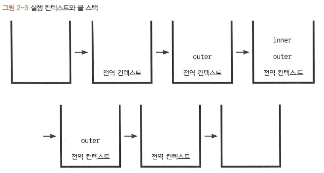
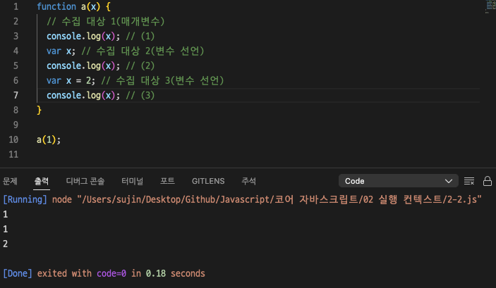
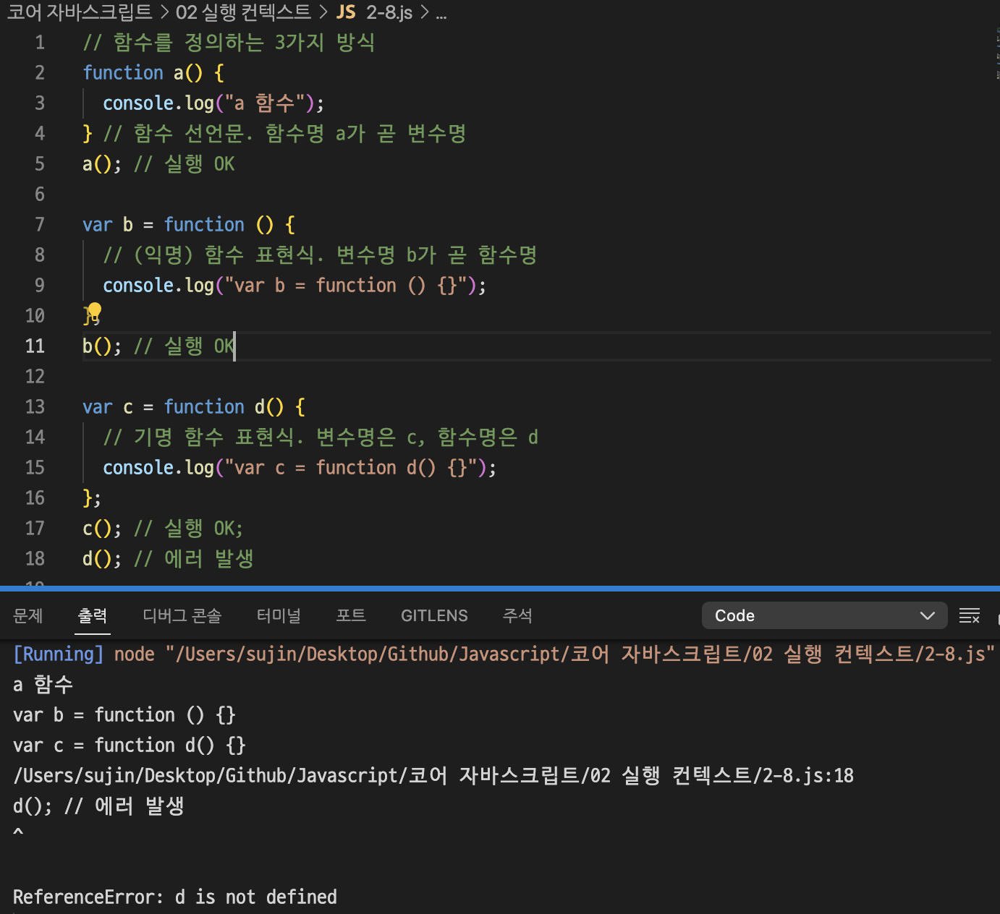
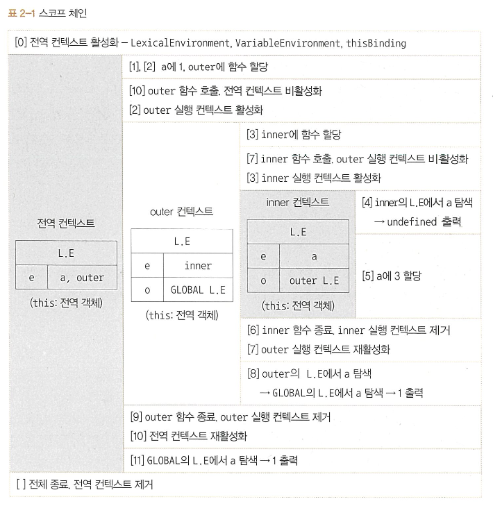

# 실행 컨텍스트

실행 컨텍스트: 실행할 코드에 제공할 환경 정보들을 모아놓은 객체

## 01 실행 컨텍스트란?

동일한 환경에 있는 코드들을 실행할 때 필요한 환경 정보들을모아 컨텍스트를 구성

이를 콜 스택에 쌓아올렸다가, 가장 위에 쌓여있는 컨텍스트와 관련 있는 코드들을 실행하는 식으로 전체 코드의 환경과 순서를 보장

```jsx
//-------------------(1)
var a = 1;
function outer() {
  function inner() {
    console.log(a); // undefined
    var a = 3;
  }
  inner(); // ------ (2)
  console.log(a); // 1
}
outer(); // ---------- (3)
console.log(a); // 1
```



(1) 처음 자바스크립트 코드를 실행하는 순간 전역 컨텍스트가 콜 스택에 담긴다

(3) outer 함수를 호출하면 자바스크립트 엔진은 outer에 대한 환경 정보를 수집해서 outer 실행 컨텍스트를 생성한 후 콜스택에 담는다.

→ 콜스택 맨 위에 outer 실행 컨텍스트가 놓인 상태, 전역 컨텍스트와 관련된 코드의 실행을 일시중단하고 outer 함수 내부 코드들을 순차적으로 실행

(2)에서 inner 함수의 실행 컨텍스트가 콜 스택의 가장 위에 담기면 outer 컨텍스트와 관련된 코드의 실행을 중단하고 inner 함수 내부의 코드를 순서대로 진행

한 실행 컨텍스트가 콜 스택의 맨 위에 쌓이는 순간이 곧 현재 실행할 코드에 관여하게 되는 시점

기존의 컨텍스트는 새로 쌓인 컨텍스트보다 아래에 위치할 수 밖에 없다

어느 실행 컨텍스트가 활성화될때 자바스크립트 엔진은 해당 컨텍스트에 관련된 코드들을 실행하는데 필요한 환경 정보들을 수집해서 실행 컨텍스트 객체에 저장

실행 컨텍스트 객체는 자바스크립트 엔진이 활용할 목적으로 생성

- VariableEnvironment: 현재 컨텍스트 내의 식별자들에 대한 정보 + 외부 환경 정보. 선언 시점의 LexicalEnvironment의 스냅샷, 변경사항 반영 안됨
- LexicalEnvironment: 처음에는 VariableEnvironment와 같지만 변경 사항 실시간으로 반영
- ThisBinding: this 식별자가 바라봐야할 대상 객체

## 02 VariableEnvironment

최초 실행 시의 스냅샷을 유지

실행 컨텍스트를 생성할 때, VariableEnvironment에 정보를 먼저 담은 다음, 이를 그대로 복사해서 LexicalEnvironment를 만들고, 이후에는 LexicalEnvironment를 주로 활용

VariableEnvironment와 LexicalEnvironment의 내부는 environmentRecord와 outer-EnvironmentReference로 구성

## 03 LexicalEnvironment

- 어휘적 환경, 정적 환경
- 현재 컨텍스트의 내부에는 a,b,c 와 같은 식별자들이 있고 그 외부 정보는 D를 참조하도록 구성되어 있다
  ⇒ 컨텍스트를 구성하는 환경 정보들을 사전에서 접하는 느낌으로 모아놓은 것

### 2-3-1 environmentRecord와 호이스팅

- 현재 컨텍스트와 관련된 코드의 식별자 정보들이 저장됨
- 자바스크립트 엔진은 식별자들을 최상단으로 끌어올려놓은 다음 실제 코드를 실행한다

**호이스팅 규칙**

environmentRecord에는 매개변수의 이름, 함수 선언, 변수명 등이 담긴다

```jsx
function a (x) { // 수집 대상 1(매개변수)
	console.log(x);    // (1)
	var x;             // 수집 대상 2(변수 선언)
	console.log(x);    // (2)
	var x = 2;         // 수집 대상 3(변수 선언)
	console.log(x);    // (3)
｝
a(1)
```

호이스팅 되지 않았을 때, (1)에서는 1, (2)에서는 undefined, (3)에서는 2가 출력된다

실제로는 (1)에서는 1, (2)에서는 1, (3)에서는 2 가 출력된다



**함수 선언의 호이스팅**


1에서는 undefined, 2에서는 bbb, 3에서는 function 으로 출력될거라고 예상했는데

실제로는 1에서 function, 3에서 bbb가 출력된다.

a 함수를 실행하는 순간 a 함수의 실행 컨텍스트가 생성된다

이때 변수명과 함수 선언의 정보를 위로 끌어올린다.

변수는 선언부와 할당부를 나누어 선언부만 끌어올리는 반면에, 함수 선언은 함수 전체를 끌어올린다

```jsx
function a() {
  var b; // 수집 대상 1. 변수는 선언부만 끌어올린다
  var b = function b() {}; // 수집 대상 2. 함수 선언은 전체를 끌어올린다

  console.log(b); // (1)
  b = "bbb"; // 변수 할당부는 원래자리에
  console.log(b); // (2)
  console.log(b); // (3)
}
```

함수 선언문과 함수 표현식

함수 선언문: function 정의부만 존재하고 별도의 할당 명령이 없는 것

함수 표현식: 정의한 function을 별도의 변수에 할당하는 것

```jsx
// 함수를 정의하는 3가지 방식
function a() {
  console.log("a 함수");
} // 함수 선언문. 함수명 a가 곧 변수명
a(); // 실행 OK

var b = function () {
  // (익명) 함수 표현식. 변수명 b가 곧 함수명
  console.log("var b = function () {}");
};
b(); // 실행 OK

var c = function d() {
  // 기명 함수 표현식. 변수명은 c, 함수명은 d
  console.log("var c = function d() {}");
};
c(); // 실행 OK;
d(); // 에러 발생
```



함수 선언문과 함수 표현식의 실질적인 차이

```jsx
console.log("sum", sum(1, 2));
console.log("multi", multiply(3, 4));

// 함수 선언문 sum
function sum(a, b) {
  return a + b;
}

// 함수 표현식 multiply
var multiply = function (a, b) {
  return a * b;
};
```

호이스팅 완료 상태에서의 동작 순서

```jsx
var sum = function sum(a, b) {
  // 함수 선언문은 전체를 호이스팅
  return a + b;
};

var multiply; // 변수는 선언부만 끌어올리기

console.log("sum", sum(1, 2));
console.log("multi", multiply(3, 4));

multiply = function (a, b) {
  // 변수의 할당부는 원래 자리에 남겨두기
  return a * b;
};
```

1. 메모리 공간을 확보하고 확보된 공간의 주솟값을 변수 sum에 연결
2. 또 다른 메모리 공간을 확보하고 그 공간의 주솟값을 변수 multiply에 연결
3. sum 함수를 또 다른 메모리 공간에 저장하고, 그 주솟값을 앞서 선언한 변수 sum의 공간에 할당

   ⇒ 변수 sum은 함수 sum을 바라보는 상태

4. sum 실행
5. multiply는 값이 할당되어 있지 않으므로 multiply is not a function 이라는 error 메시지 출력
6. multiply 함수는 그 전에 발생한 에러로 인해 실행하지 않은채 런타임 종료

### 2-3-2 스코프, 스코프 체인, outerEnvironmentReference

- 스코프: 식별자에 대한 유효범위
- 스코프 체인: 식별자의 유효범위를 안에서 바깥으로 차례로 검색해나가는 것

⇒ 이를 가능하게 하는 것이 LexicalEnvironment의 두번째 수집 자료 `outerEnvironmentReference`

**스코프 체인**

여러 스코프에서 동일한 식별자를 선언한 경우에는 무조건 스코프 체인 상에서 가장 먼저 발견된 식별자에만 접근 가능

```jsx
// scope chain
var a = 1;
var outer = function () {
  var inner = function () {
    console.log(a);
    var a = 3;
  };
  inner();
  console.log(a);
};
outer();
console.log(a);
```



inner 함수 내부에서 선언한 a 변수는 전역 공간에서 선언한 동일한 이름의 a 변수에는 접근할 수 없다

⇒ 변수 은닉화

**전역변수와 지역변수**

전역 스코프에서 선언한 a, outer가 전역 변수 ⇒ 전역 공간에서 선언한 변수는 전역변수

지역변수는 outer 함수 내부에서 선언한 inner와 inner 함수 내부에서 선언한 a 변수 ⇒ 함수 내부에서 선언한 변수는 무조건 지역변수

## 04 this

실행 컨텍스트의 thisBinding에는 this로 지정된 객체가 저장됨

실행 컨텍스트 활성화 당시에 this가 지정되지 않은 경우 this에는 전역 객체가 저장됨
