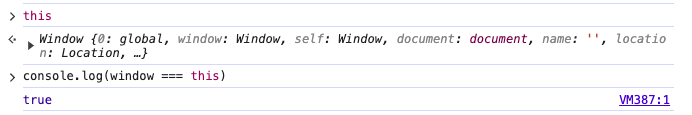
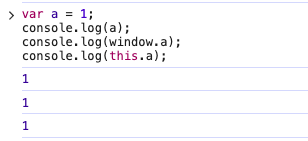
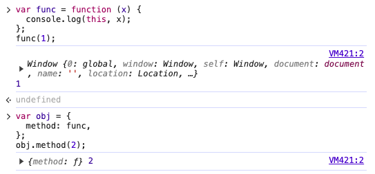
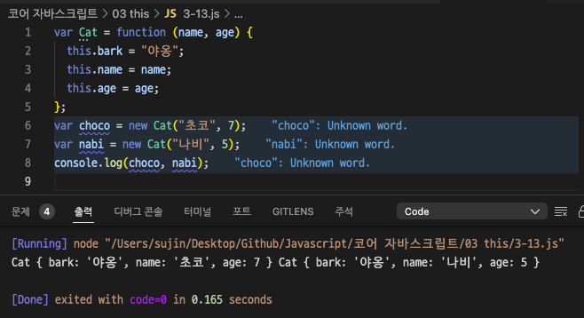
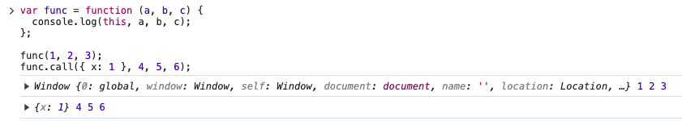
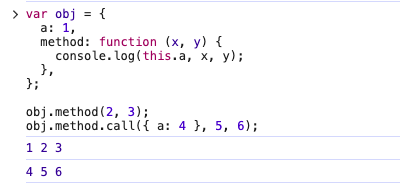
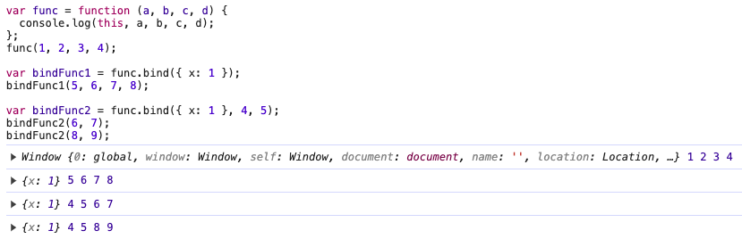
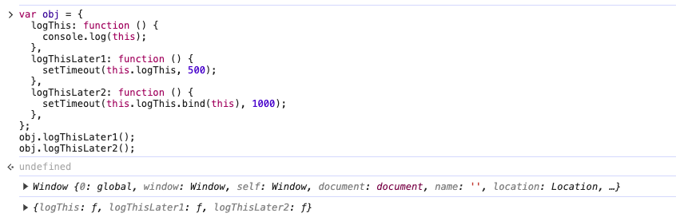
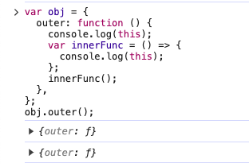
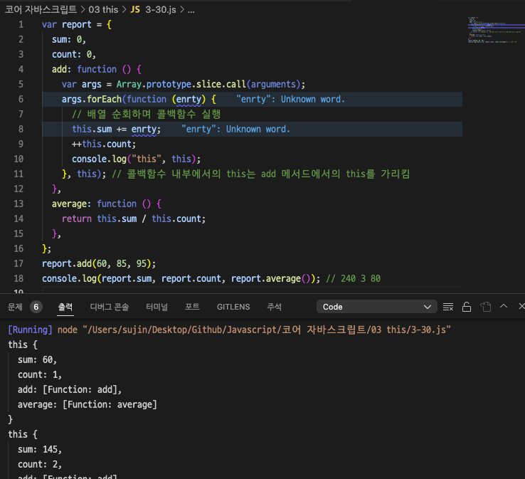

## 01 상황에 따라 달라지는 this

this는 기본적으로 실행 컨텍스트가 생성될 때 함께 결정됨

실행컨텍스트는 함수를 호출할 때 생성 → this는 함수를 호출할 때 결정됨

### 3-1-1 전역 공간에서의 this

- 전역 공간에서 this는 전역 객체를 가리킨다
- 전역 컨텍스트를 생성하는 주체 = 전역 객체
- 브라우저 환경에서의 전역객체: window
  

- Node.js 환경에서의 전역객체: global

  

전역변수를 선언하면 자바스크립트 엔진은 이를 전역객체의 프로퍼티로 할당

Q: a를 직접 호출할때도 1이 나오는 이유는?

A: 변수 a에 접근하고자 하면 스코프 체인에서 a를 검색하다가 전역객체에서 해당 프로퍼티 a를 발견해서 그 값을 반환하기 때문이다. window. 이 앞에 생략된거라고 볼 수 있다

### 3-1-2 메서드로서 호출할 때 그 메서드 내부에서의 this

**함수 vs. 메서드**

2가지 함수 실행 방법

1. 함수로서 호출하기
1. 메서드로서 호출하기

함수와 메서드를 구분하는 유일한 차이: 독립성

- 함수는 그 자체로 독립적인 기능을 수행
- 메서드는 자신을 호출한 대상 객체에 관한 동작을 수행



func(1)의 this는 window지만,

obj.method(2)에서의 this는 obj의 method 프로퍼티에 할당한 값을 참조한다

⇒ 변수에 담아 호출한 경우와 obj 객체의 프로퍼티에 할당해서 호출한 경우에 this가 달라진다

함수로서의 호출과 메서드로서의 호출은 함수 앞에 점이 있는지 여부만으로 구분이 가능하다

func(1) 점이 없으므로 함수로서 호출

obj.method(2) 점이 있으므로 메소드로서 호출

**메서드 내부에서의 this**

this에는 호출한 주체에 대한 정보가 담긴다

- 함수를 메서드로서 호출하는 경우: 호출 주체는 바로 함수명 앞의 객체
- 점 표기법의 경우: 마지막 점 앞에 명시된 객체


### 3-1-3 함수로서 호출할 때 그 함수 내부에서의 this

**함수 내부에서의 this**

어떤 함수를 함수로서 호출할 경우에는 this가 지정되지 않는다

→ 호출 주체를 명시하지 않고 개발자가 코드에 직접 관여해서 실행한 것이므로

함수에서의 this는 전역객체를 가리킨다

**메서드의 내부함수에서의 this**

```jsx
var obj1 = {
  outer: function () {
    console.log(this); // obj1
    var innerFunc = function () {
      console.log(this); // window   // obj2
    };
    innerFunc();

    var obj2 = {
      innerMethod: innerFunc,
    };
    obj2.innerMethod();
  },
};
obj1.outer();
```

7번째 줄에서는 innerFunc을 함수로서 호출

12번째 obj2.innerMethod()에서는 innerFunc 함수를 메서드로서 호출

**this를 바인딩하지 않는 함수**

함수 내부에서 this가 전역객체를 바라보는 문제를 보완하기 위해 this를 바인딩하지 않는 **화살표 함수** 새로 도입

화살표 함수는 실행 컨텍스트를 생성할때 this 바인딩 과정 자체가 빠지게 되어, 상위 스코프의 this를 그대로 활용 가능

### 3-1-4 콜백 함수 호출 시 그 함수 내부에서의 this

함수 A의 제어권을 다른 함수(또는 메서드) B에게 넘겨주는 경우 함수 A를 콜백 함수라고 부른다

제어권을 받은 함수에서 콜백 함수에 별도로 this가 될 대상을 지정한 경우에는 그 대상을 참조한다

```jsx
setTimeout(function () {
  console.log(this);
}, 300);

[1, 2, 3, 4, 5].forEach(function (x) {
  console.log(this, x);
});

document.body.innerHTML += '<button id="a">클릭</button>';
document.body.querySelector("#a").addEventListener("click", function (e) {
  console.log(this, e);
});
```

setTimeout 함수와 foreach 메서드는 내부에서 콜백함수를 호출할때 대상이 될 this를 지정하지 않으므로 this는 전역객체 참조

addEventListener 메서드는 콜백 함수를 호출할 때 자신의 this를 상속하도록 정의되어 있으므로 메서드명의 점 앞부분이 this 라고 볼 수 있다

### 3-1-5 생섬자 함수 내부에서의 this

생성자 함수: 공통된 성질을 지니는 객체들을 생성하는데 사용하는 함수

자바스크립트는 함수에 생성자로서의 역할을 함께 부여했다

- new 명령어와 함께 함수를 호출하면 해당 함수가 생성자로서 동작하게 된다
- 어떤 함수가 생성자 함수로서 호출된 경우 내부에서의 this는 곧 새로 만들 구체적인 인스턴스 자신이 된다

생성자 함수를 호출하면

1. 생성자의 prototype 프로퍼티를 참조하는 `__proto__` 라는 프로퍼티가 있는 객체를 만들고
1. 미리 준비된 공통 속성 및 개성을 해당 객체에 부여
1. 구체적인 인스턴스 생성



## 02 명시적으로 this를 바인딩하는 방법

this에 별도의 대상을 바인딩하는 방법을 알아보자

### 3-2-1 call 메서드

```jsx
Function.prototype.call(thisArg[, arg1[, arg2[, ...]]])
```

- call 메서드: 메서드의 호출 주체인 함수를 즉시 실행하도록 하는 명령
- call 메서드의 첫 번째 인자를 this로 바인딩, 이후의 인자들을 호출할 함수의 매개변수로



call 메서드를 이용하면 임의의 객체를 this로 지정 가능



### 3-2-2 apply 메서드

- call 메서드와 기능적으로 완전히 동일
- 두번째 인자를 배열로 받아 그 배열의 요소들을 호출할 함수의 매개변수로 지정

```jsx
var func = function (a, b, c) {
  console.log(this, a, b, c);
};

func.apply({ x: 1 }, [4, 5, 6]); // {x: 1} 4 5 6

var obj = {
  a: 1,
  method: function (x, y) {
    console.log(this.a, x, y);
  },
};

obj.method.apply({ a: 4 }, [5, 6]); // 4 5 6
```

### 3-2-3 call / apply 메서드의 활용

**유사배열객체(array-like object)에 배열 메서드를 적용**

```jsx
var obj = {
  0: "a",
  1: "b",
  2: "c",
  length: 3,
};
Array.prototype.push.call(obj, "d");
console.log(obj); // { 0: 'a', 1: 'b', 2: 'c', 3: 'd', length: 4 }

// slice 메서드를 적용해 객체를 배열로 전환
var arr = Array.prototype.slice.call(obj);
console.log(arr); // ['a', 'b','c','d']
```

- 객체에는 배열 메서드 직접 적용 불가능
- 키가 0 또는 양의 정수인 프로퍼티가 존재하고
- length 프로퍼티의 값이 0 또는 양의 정수인 객체
- call apply 메서드를 이용해 배열 메서드를 차용 가능

**생성자 내부에서 다른 생성자를 호출**

생성자 내부에 다른 생성자와 공통된 내용이 있을 경우 call 또는 apply를 이용해 다른 생성자를 호출하면 간단하게 반복 줄이기 가능

```jsx
function Person (name, gender) {
	this.name = name;
	this.gender = gender;
}
function Student(name, gender, school) {
	Person.call(this, name, gender);
	this.school = school;
}
function Employee(name, gender, company) {
	Person.apply (this, (name, gender));
	this.company = company;
｝
var by = new Student('보', 'female', '단국대'):
var jn = new Employee('재난', 'male', '구골')
```

**여러 인수를 묶어 하나의 배열로 전달하고 싶을 때 → apply 활용**

배열에서 최대/최솟값을 구해야할 경우 apply를 사용하기

```jsx
var numbers = [10, 20, 3, 16, 45];
var max = Math.max(...numbers);
var min = Math.min(...numbers);
console.log(max, min); // 45 3
```

call/apply 메서드의 단점: this를 예측하기 어려워 코드 해석을 방해

### 3-2-4 bind 메서드

즉시 호출하지 않고 넘겨 받은 this 및 인수들을 바탕으로 새로운 함수를 반환하기만 하는 메서드

- 함수에 this를 미리 적용하는 것
- 부분 적용 함수를 구현



func.bind({ x: 1 }); ⇒ this만 지정한 것

func.bind({ x: 1 }, 4, 5); ⇒ this 지정과 함께 부분 적용 함수 구현

**name 프로퍼티**

어떤 함수의 name 프로퍼티가 ‘bound xxx’라면 이는 곧 함수명이 xxx인 원본 함수에 bind 메서드를 적용한 새로운 함수라는 의미

→ call /apply 보다 코드 추적하기 수월

```jsx
var func = function (a, b, c, d) {
  console.log(this, a, b, c, d);
};
var bindFunc = func.bind({ x: 1 }, 4, 5);
console.log(func.name); // func
console.log(bindFunc.name); // bound func
```

**상위 컨텍스트의 this를 내부함수나 콜백함수에 전달하기**

```jsx
var obj = {
  outer: function () {
    console.log(this);
    var innerFunc = function () {
      console.log(this);
    };
    innerFunc.call(this);
  },
};
obj.outer();

var obj = {
  outer: function () {
    console.log(this);
    var innerFunc = function () {
      console.log(this);
    }.bind(this);
    innerFunc();
  },
};
obj.outer();
```

기본적으로 콜백 함수 내에서의 this에 관여하는 함수 또는 메서드에 대해서도 bind 메서드를 이용하면 this 값을 사용자의 입맛에 맞게 바꾸기 가능



### 3-2-5 화살표 함수의 예외사항

- 화살표 함수는 실행 컨텍스트 생성 시 this를 바인딩하는 과정이 제외됨
- 화살표 함수 내부에는 this가 아예 없다
- 접근하려면 스코프체인상 가장 가까운 this에 접근하게 된다



별도의 변수로 this를 우회하거나 call/apply/bind 적용할 필요 없음

### 3-2-6 별도의 인자로 this를 받는 경우(콜백 함수 내에서의 this)

콜백 함수를 인자로 받는 메서드 중 일부는 추가로 this로 지정할 객체를 인자로 지정할 수 있는 경우가 있음

이러한 메서드의 thisArg 값을 지정하면 콜백 함수 내부에서 this 값을 원하는 대로 변경 가능

⇒ 여러 내부 요소에 대해 같은 동작을 반복 수행해야하는 배열 메서드에 많이 포진되어 있음



## 03 정리

명시적 this 바인딩이 없는 한 늘 성립하는 규칙

- 전역공간에서의 this는 전역객체를 참조
- 어떤 함수를 메서드로서 호출한 경우 this는 메서드 호출 주체를 참조
- 어떤 함수를 함수로서 호출한 경우 this는 전역객체를 참조.
- 콜백 함수 내부에서의 this는 해당 콜백 함수의 제어권을 넘겨받은 함수가 정의한 바에 따르며, 정의하지 않은 경우에는 전역객체를 참조
- 생성자 함수에서의 this는 생성될 인스턴스 참조

명시적 this 바인딩으로 this 예측하기

- call, apply 메서드는 this를 명시적으로 지정하면서 함수 또는 메서드를 호출
- bind 메서드는 this 및 함수에 넘길 인수를 일부 지정해서 새로운 함수 생성
- 요소를 순회하면서 콜백 함수를 반복 호출하는 내용의 일부 메서드는 별도의 인자로 this 받기도 함
